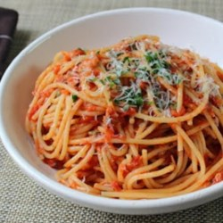

---
author:
- Paul Agapow (p.agapow@imperial.ac.uk)
institute: Data Science Institute, Imperial College London
title: Big Data in the Clinic and Hospital
subtitle: Promises and pitfalls
date: 2018/1/1
#classoption: aspectratio=169
#handout,notes=show
titlepage-note: |
  This is a note that goes on the title page.

#fontsize: 17pt
#theme: metropolis
fonttheme: "structurebold"

...

# In the morning

> Blockquotes are very handy in email to emulate reply text.
> This line is part of the same quote.

Quote break.

> This is a very long line that will still be quoted properly when it wraps. Oh boy let's keep writing to make sure this is long enough to actually wrap for everyone. Oh, you can *put* **Markdown** into a blockquote.

# Getting up

- Turn off alarm
- Get out of bed

Horizontal rules "---" and the like get turned into slide breaks by pandoc

# test cols

:::::::::::::: {.columns}
::: {.column width="40%"}
contents...
:::
::: {.column width="40%"}
contents...
:::
::::::::::::::

# Breakfast

- Eat eggs
- Drink coffee

::: notes

This is my note.

- It can contain Markdown
- like this list

:::

# In the evening

| Tables        | Are           | Cool  |
| ------------- |:-------------:| -----:|
| col 3 is      | right-aligned | $1600 |
| col 2 is      | centered      |   $12 |
| zebra stripes | are neat      |    $1 |

Stuff under the insertsubtitle

# Dinner

- Eat spaghetti
- Drink wine
- do stuff

-------

# Going to sleep

- Get in bed
- Count sheep
